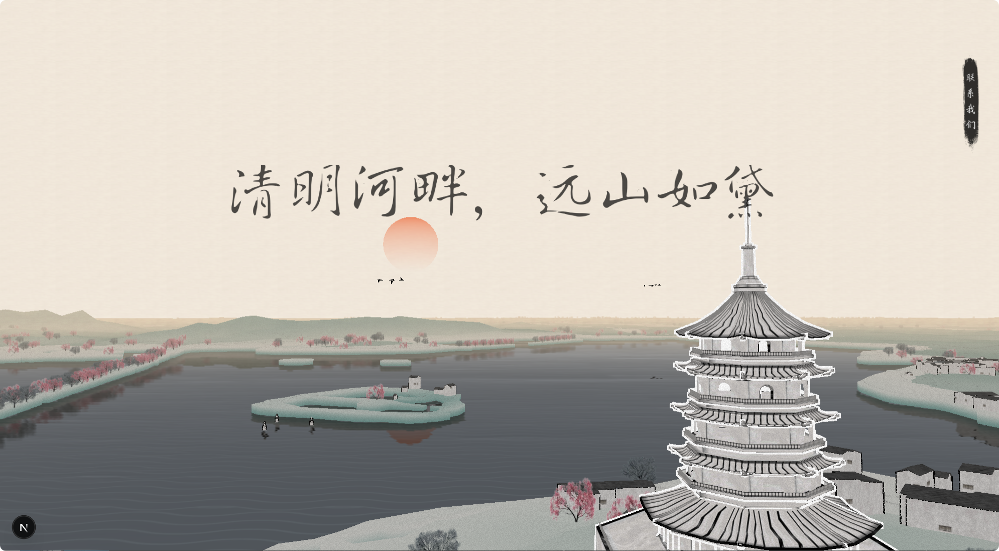

# WaterInk Hangzhou 水墨杭州

[简体中文](../README.md) | **English**

A WebGL webpage presenting Hangzhou in an ink-wash painting style. Built on a procedurally generated city (houses, roads, trees) with custom GLSL shaders, it renders an interactive 3D view of Hangzhou as a traditional Chinese ink painting.



## Features

- **WebGL ink-wash rendering scene**: Built with Three.js (`src/features/WebglScene.tsx`) plus multiple custom GLSL shaders (water surface, ink effects, etc., see `src/features/shaders/`)
- **Procedural city data**: Houses, roads, trees, and stadium geometry organized as JSON (`src/features/data/`)
- **Poems & landmarks**: Scattered throughout the scene are Hangzhou-related poems (`poems.json`) and landmark tags (`tags.json`)
- **BMFont text rendering**: Supports both WebGL text (`bmfont.ts`) and DOM text (`bmfont-dom.ts`), using a cursive (xíngcǎo) typeface (`font/xingcao-font.json`)

## Quick Start

Requirement: Node.js >= 24

```bash
# Install dependencies
npm install

# Start the dev server
npm run dev
```

Then open <http://localhost:3000>.

## Build & Checks

```bash
# Production build
npm run build

# Lint + typecheck + build (all in one)
npm run check
```

## Project Structure

```
.
├── docs/                  # Docs and asset images
│   ├── assets/
│   └── README.en.md       # English README
├── public/                # Static assets
├── src/
│   ├── app/               # Next.js App Router (pages, layout, global styles)
│   ├── features/          # Core features
│   │   ├── shaders/       # Custom GLSL shaders
│   │   ├── data/          # City, poem, and tag JSON data
│   │   └── font/          # Cursive font (BMFont format)
│   └── types/             # Type declarations
├── next.config.ts
└── package.json
```

## Tech Stack

- [Next.js](https://nextjs.org/) 16 · React 19
- [Three.js](https://threejs.org/) 0.186 (WebGL rendering)
- [Tailwind CSS](https://tailwindcss.com/) 4
- TypeScript 5 · ESLint 9
